# What is LACP?
`LACP` stands for `Link Aggregation Control Protocol`. It is a protocol used in computer networking to combine multiple physical network links into a single logical link, also known as a `link aggregation group (LAG)` or a `port channel`. The purpose of LACP is to increase the overall bandwidth and provide redundancy by distributing network traffic across multiple links.

LACP allows network devices, such as switches, to negotiate and establish a LAG by exchanging LACP packets. These packets contain information about the participating links, such as their capabilities and status. Through this negotiation process, the devices determine which links can be aggregated and form a LAG.

Once the LAG is formed, LACP enables the devices to distribute traffic across the links using a load-balancing algorithm. This load balancing can be based on various factors, including source and destination IP addresses, MAC addresses, or transport protocol ports.

LACP provides several benefits, including increased bandwidth, improved network performance, and redundancy. By combining multiple links, LACP allows for greater aggregate bandwidth, enabling higher data transfer rates. It also helps in load distribution, preventing congestion on individual links. Additionally, if one link fails, LACP can automatically redistribute the traffic to the remaining links, ensuring uninterrupted connectivity.

LACP is commonly used in enterprise networks, data centers, and other environments where high bandwidth and link redundancy are required. It is standardized by the [IEEE 802.3ad](https://www.ieee802.org/3/hssg/public/apr07/frazier_01_0407.pdf) standard and is supported by various networking equipment manufacturers.

In an LACP (Link Aggregation Control Protocol) connection, the client is typically referred to as an LACP-enabled device or an LACP participant. The client can be any network device that supports LACP and wants to establish a link aggregation group (LAG) with a switch or another LACP-enabled device.

# LACP Negotiation
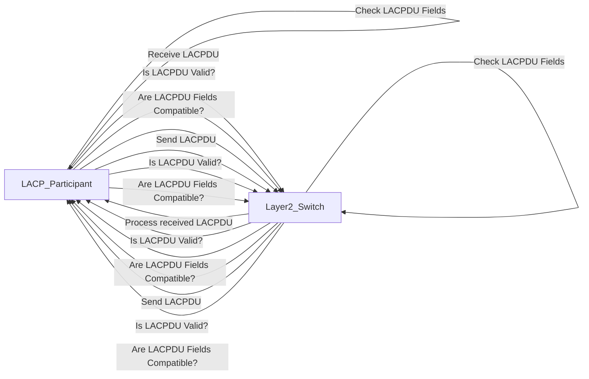

```mermaid
```

Below is the process through which an LACP participant negotiates a LAG (Link Aggregation Group) with a Layer 2 switch:

1. The LACP participant (LACP-enabled device) initiates the negotiation by sending LACPDU (Link Aggregation Control Protocol Data Unit) frames to the Layer 2 switch.
```mermaid
sequenceDiagram
  participant LACP_Participant as LACP Participant
  participant Layer2_Switch as Layer 2 Switch

  LACP_Participant->>Layer2_Switch: Send LACPDU
```
   
2. The Layer 2 switch receives the LACPDU frames from the participant and processes the information contained within them.
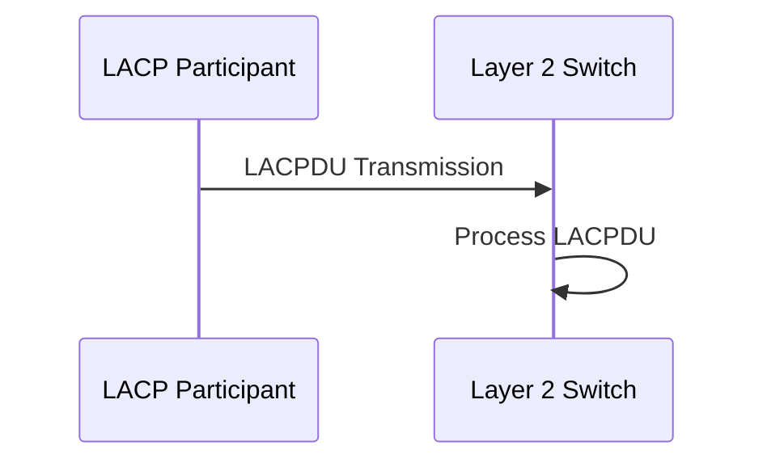

3. The LACP participant waits for a response from the switch and enters a loop to continue the negotiation process.
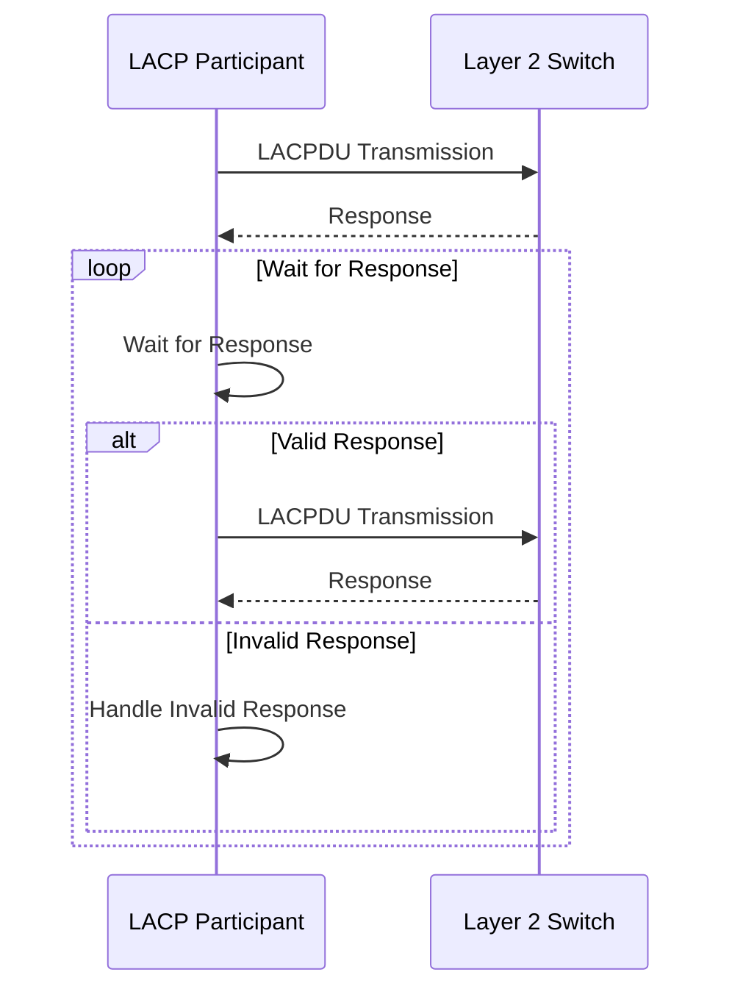

4. The switch checks the validity of the received LACPDU frames, ensuring that the fields, such as compatibility, operational modes, and other parameters, are correctly populated.
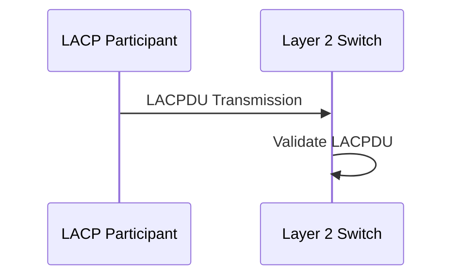

5. The switch determines if the received LACPDU frames are compatible with its own capabilities and configuration.
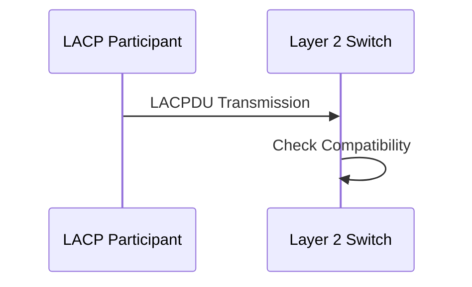

6. If the LACPDU frames are compatible, the switch sends a response by transmitting its own LACPDU frames back to the participant.
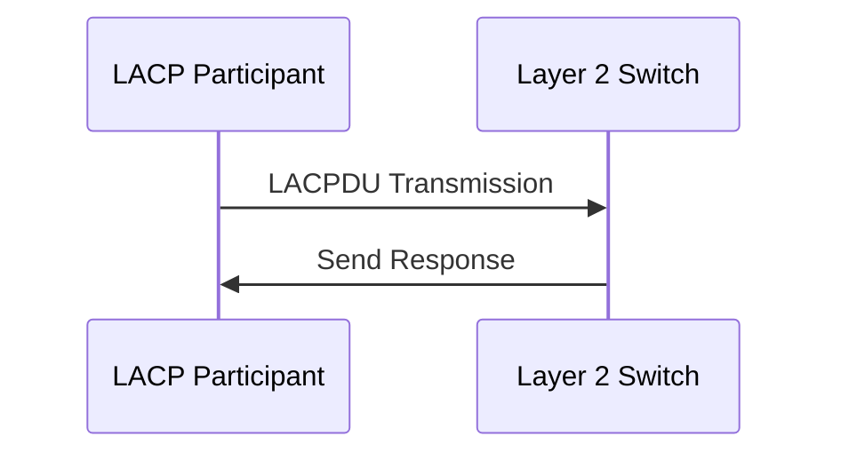

7. The LACP participant receives the switch's LACPDU frames and verifies their validity and compatibility.
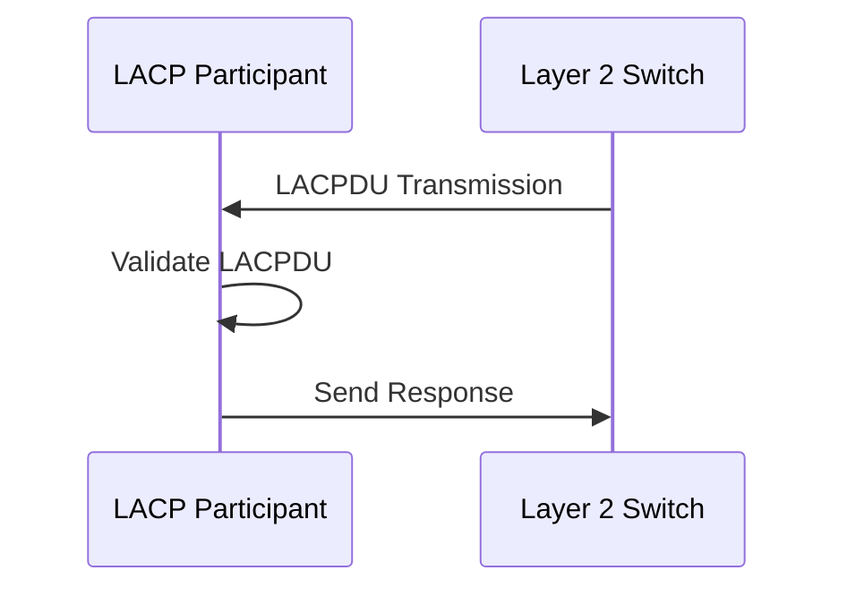

8. The participant may further check the LACPDU fields to ensure compatibility with its own configuration and capabilities.
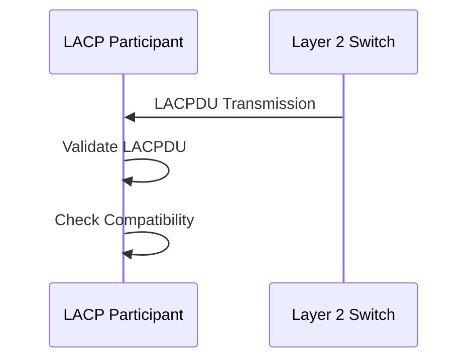

9. If the participant determines that the received LACPDU frames are compatible, it proceeds to send additional LACPDU frames to the switch to continue the negotiation.
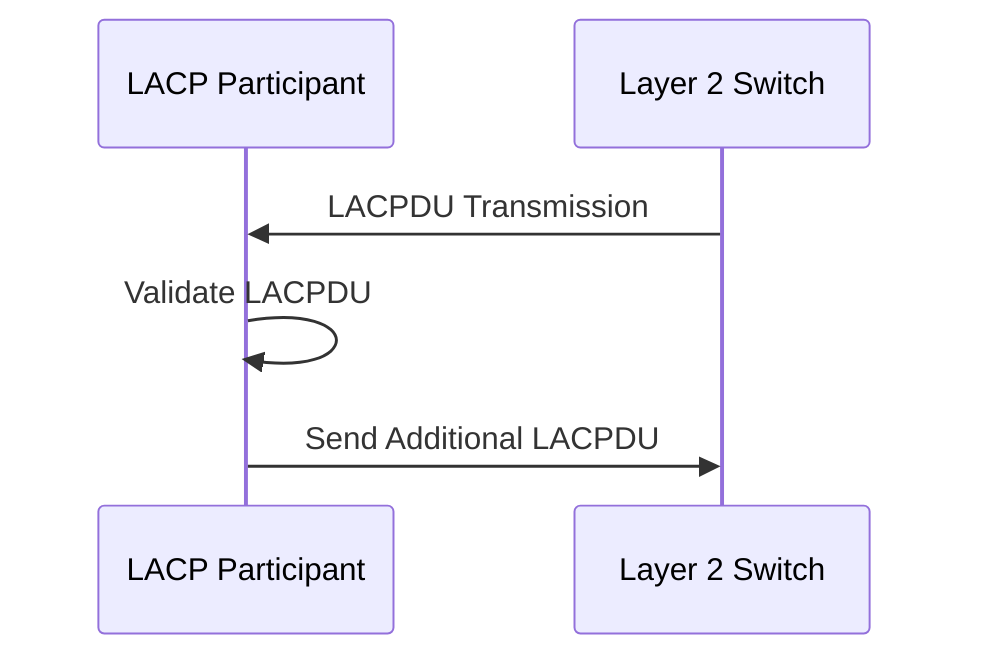

10. The switch, upon receiving the participant's LACPDU frames, performs further compatibility checks.
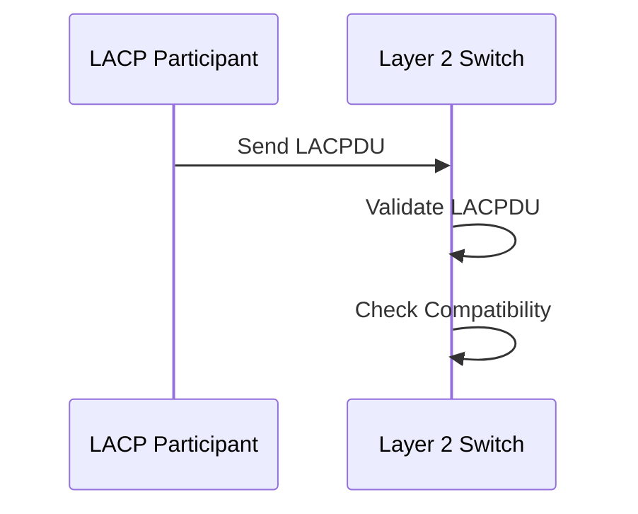

11. The negotiation process continues with the LACP participant and the switch exchanging LACPDU frames and verifying compatibility until both sides agree on the parameters.
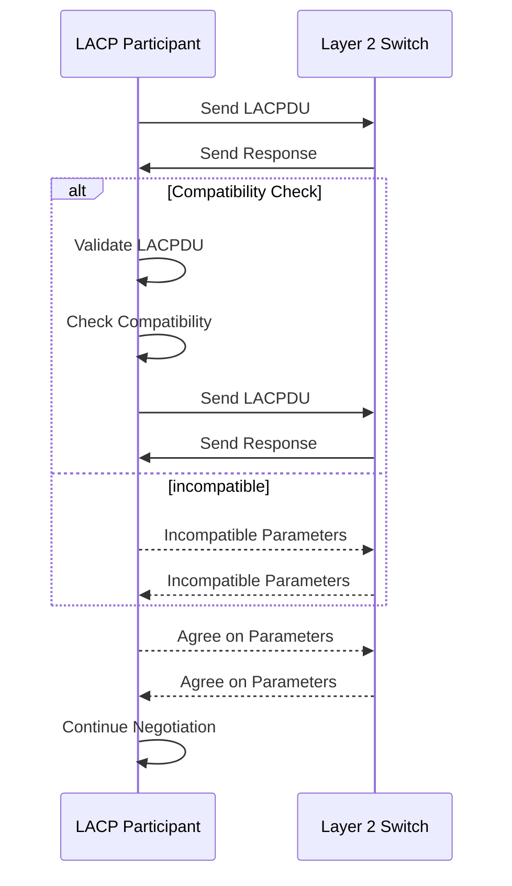

12. Once the negotiation is successfully completed, a LAG (Link Aggregation Group) is established between the LACP participant and the Layer 2 switch.
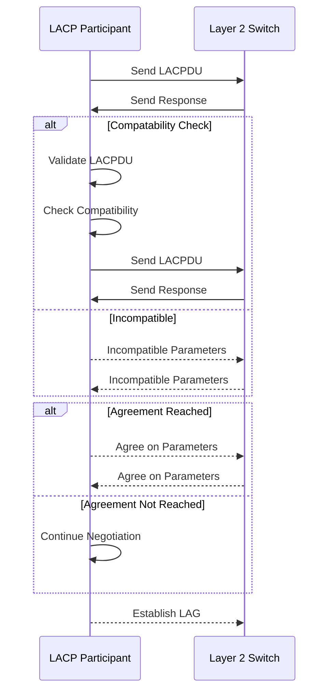

13. The LACP participant and the switch load balance the traffic across the links within the LAG, providing increased bandwidth and redundancy.
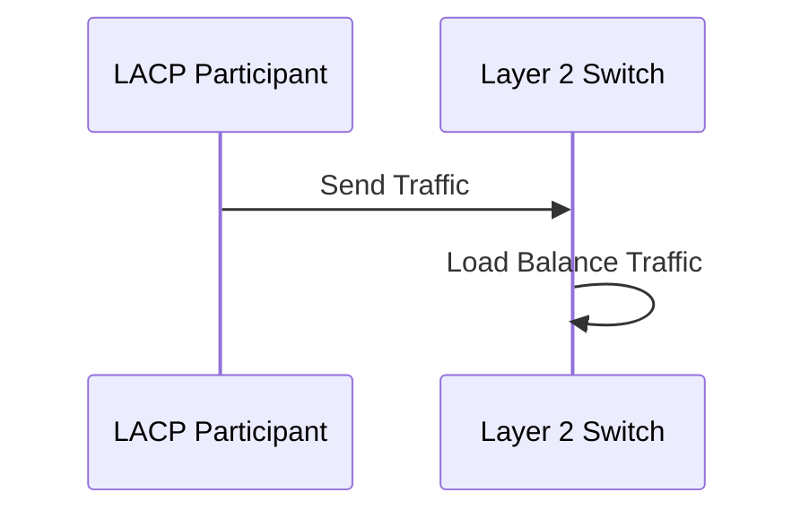
The negotiation process ensures that both the LACP participant and the Layer 2 switch agree on the parameters and establish a functional LAG, allowing for aggregated bandwidth and improved network performance.

# Link Aggregation Control Protocol Data Unit (LACPDU)
LACPDU stands for Link Aggregation Control Protocol Data Unit. It is a type of frame or packet used in LACP. LACPDU carries the control information required for the negotiation and maintenance of link aggregation between LACP-enabled devices.

Here's a breakdown of the components typically found in an LACPDU:

1. `LACPDU Header`: The header contains information about the LACPDU frame, such as its type and length.

2. `System ID`: The System ID field identifies the LACP-enabled device sending the LACPDU. It typically includes a system priority value and a system identifier.

3. `Port Priority`: The Port Priority field indicates the priority of the specific port on the LACP-enabled device sending the LACPDU.

4. `Port Number`: The Port Number field specifies the port number of the LACP-enabled device sending the LACPDU.

5. `Timeouts`: LACPDU includes timeout values to specify how long an LACP participant should wait before timing out or expiring.

6. `State Information`: The State Information field conveys the current operational state of the port, such as whether it is Active or Passive.

7. `Partner System ID`: The Partner System ID field contains the System ID of the LACP partner (the LACP-enabled device at the other end of the link).

8. `Partner Port Priority`: The Partner Port Priority field represents the priority of the port on the LACP partner device.

9. `Partner Port Number`: The Partner Port Number field indicates the port number on the LACP partner device.

These components within the LACPDU frame are crucial for LACP-enabled devices to exchange information and negotiate the establishment and maintenance of link aggregation groups (LAGs). The LACPDU frames are exchanged between LACP participants, such as switches, routers, or servers, to facilitate the formation and operation of LAGs, providing increased bandwidth and link redundancy in network connections.

# How can you confirm the LACP configuration of a bond in RHEL/Fedora?
To confirm if an LACP mode 4 bond is properly configured in a RHEL (Red Hat Enterprise Linux) system, you can perform the following steps:

1. `Check the configuration files`: Open the configuration file for network interfaces, typically located in the `/etc/sysconfig/network-scripts/` directory. Look for the configuration file associated with the bond interface (e.g., `ifcfg-bondX`, where X is the bond interface number). Verify that the configuration file contains the appropriate settings for LACP mode 4. Specifically, ensure that the `BONDING_OPTS` parameter includes the `mode=4` option.

2. `Verify bond module loading`: Confirm that the bonding module is loaded into the kernel. You can check this by running the command `lsmod | grep bonding` and verifying that it returns output indicating the bonding module is loaded.

3. `Check bond status`: Use the `cat /proc/net/bonding/bondX` command, where X is the bond interface number, to display the status and configuration of the bond interface. Look for the `Bonding Mode: IEEE 802.3ad Dynamic link aggregation` line, which confirms that the bond interface is configured in LACP mode 4.
```bash
# cat /proc/net/bonding/bond0
Ethernet Channel Bonding Driver: v3.7.1 (April 27, 2011)

Bonding Mode: IEEE 802.3ad Dynamic link aggregation
Transmit Hash Policy: layer2 (0)
MII Status: up
MII Polling Interval (ms): 1
Up Delay (ms): 0
Down Delay (ms): 0

802.3ad info
LACP rate: fast
Min links: 0
Aggregator selection policy (ad_select): stable
System priority: 65535
System MAC address: aa:bb:cc:dd:ee:ff
Active Aggregator Info:
        Aggregator ID: 20
        Number of ports: 2
        Actor Key: 9
        Partner Key: 11
        Partner Mac Address: aa:aa:aa:aa:aa:aa

Slave Interface: ens3f0
MII Status: up
Speed: 1000 Mbps
Duplex: full
Link Failure Count: 1
Permanent HW addr: aa:bb:cc:dd:ee:ff
Slave queue ID: 0
Aggregator ID: 20
Actor Churn State: none
Partner Churn State: none
Actor Churned Count: 0
Partner Churned Count: 0
details actor lacp pdu:
    system priority: 65535
    system mac address: aa:bb:cc:dd:ee:ff
    port key: 9
    port priority: 255
    port number: 1
    port state: 63
details partner lacp pdu:
    system priority: 127
    system mac address: aa:aa:aa:aa:aa:aa
    oper key: 11
    port priority: 127
    port number: 22
    port state: 63

Slave Interface: ens3f1
MII Status: up
Speed: 1000 Mbps
Duplex: full
Link Failure Count: 0
Permanent HW addr: 00:11:22:33:44:55
Slave queue ID: 0
Aggregator ID: 20
Actor Churn State: none
Partner Churn State: none
Actor Churned Count: 0
Partner Churned Count: 0
details actor lacp pdu:
    system priority: 65535
    system mac address: aa:bb:cc:dd:ee:ff
    port key: 9
    port priority: 255
    port number: 2
    port state: 63
details partner lacp pdu:
    system priority: 127
    system mac address: aa:aa:aa:aa:aa:aa
    oper key: 11
    port priority: 127
    port number: 23
    port state: 63
```

4. `Monitor bond interface activity`: Monitor the bond interface's activity using tools like `ifconfig` or `ip` commands. Verify that the bond interface shows the expected configuration, including the correct number of slave interfaces, the correct link state, and the aggregated bandwidth.

5. `Test network connectivity`: Validate network connectivity by sending traffic through the bond interface and verifying that it functions as expected. You can perform network tests, such as pinging other devices or transferring data, to ensure that traffic is being load balanced across the bonded links.

By following these steps, you can confirm if an LACP mode 4 bond is properly configured in a RHEL system and ensure that it is functioning as intended.

# History of LACP
The `IEEE 802.3ad` standard, which defines Link Aggregation Control Protocol (LACP), has evolved over the years to accommodate advancements in networking technologies and address the changing needs of the industry. Here are some key developments in the evolution of the IEEE 802.3ad standard:

- `Original Standard (802.3ad-2000)`: The initial version of the standard was released in 2000 and defined the basic mechanisms for link aggregation using LACP. It specified the protocol's frame format, negotiation procedures, and methods for load balancing traffic across aggregated links.

- `Updates and Amendments`: Over time, several updates and amendments were introduced to enhance the functionality and address implementation issues. These updates include revisions to improve interoperability, clarify certain procedures, and address security concerns.

- `IEEE 802.1AX (2008)`: To provide a unified approach to link aggregation across different IEEE standards, the IEEE 802.1AX standard was introduced in 2008. It incorporated the LACP specifications from IEEE 802.3ad and extended them to other IEEE 802 standards, such as Ethernet bridging. IEEE 802.1AX defines the Link Aggregation Control Protocol (LACP) as part of the overall Link Aggregation standard.

- `Increased Capacity`: As networking technologies advanced, the need for higher link capacities and greater scalability became apparent. To address these requirements, the standard was enhanced to support higher link speeds, including Gigabit Ethernet, 10 Gigabit Ethernet, and beyond.

- `Link Aggregation in Data Centers`: With the rise of data centers and cloud computing, the IEEE 802.3ad standard was further extended to address the specific needs of these environments. Amendments were introduced to provide additional flexibility, such as support for multi-chassis link aggregation (MLAG) and enhanced management capabilities.

- `Enhanced Load Balancing`: Load balancing algorithms have been refined over time to improve traffic distribution across aggregated links. Newer versions of the standard allow for more sophisticated load balancing schemes based on Layer 3 and Layer 4 information, such as source and destination IP addresses or transport protocol ports.

It's important to note that while the IEEE 802.3ad standard has evolved, the basic principles and functionality of LACP have remained largely consistent. The updates and amendments primarily focus on enhancing interoperability, accommodating higher speeds, and adapting to changing network requirements.

